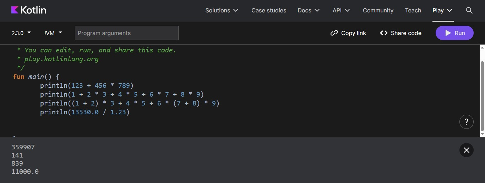
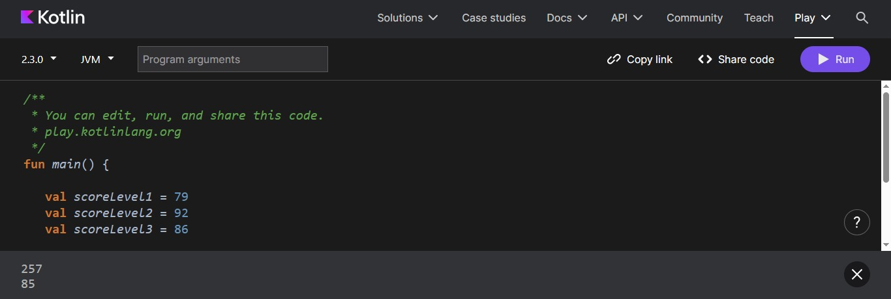
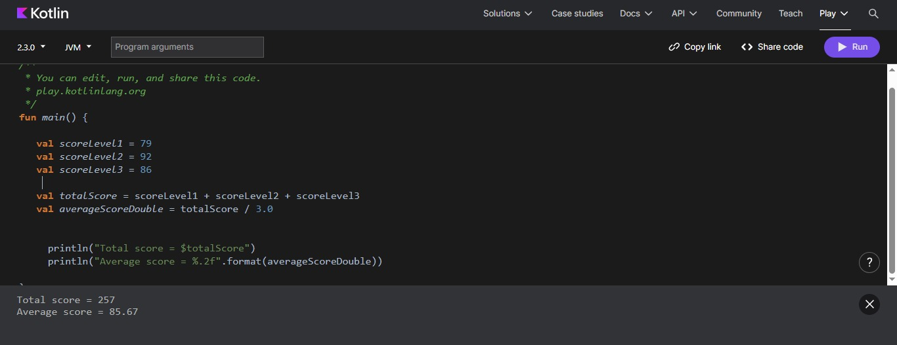

# 📘 Lab 1 — Math Operators & Variables (Kotlin)

##  📚 Cours
Fondamentaux de la programmation en Kotlin

### 🎯 Objectifs du Lab

Ce laboratoire a pour but de permettre à l’étudiant de :

Utiliser les opérateurs arithmétiques : +, -, *, /, %

Comprendre la priorité des opérations

Utiliser les parenthèses pour contrôler l’ordre des calculs

Effectuer des calculs à partir de variables

Calculer une moyenne correcte en Double

Appliquer un facteur multiplicatif (bonus)

### Résultat visuel

  
<em>Figure 1</em>
 

  
<em>Figure 1</em>
 

  
<em>Figure 1</em>
 

## 🧠 Compétences acquises

Priorité des opérateurs en Kotlin

Manipulation des types Int et Double

Calculs mathématiques simples

Utilisation des variables

Formatage de l’affichage

Structure de base d’un programme Kotlin
